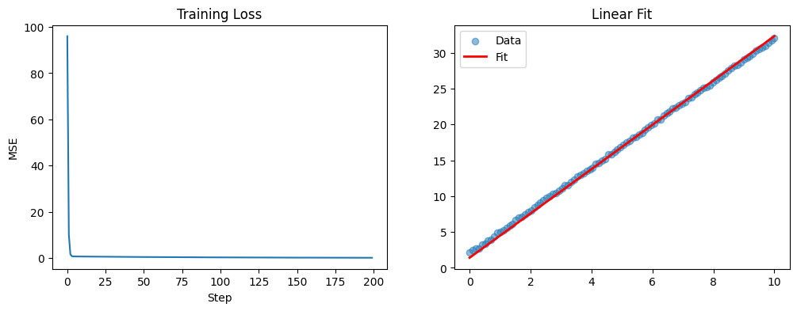
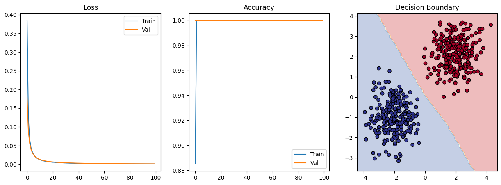

# PyTorch 7-Day Mastery 🚀

**Completed: January 1, 2026** | **Goal:** Deep PyTorch understanding for ML research/engineering

[](https://pytorch.org/)

## 🎯 Overview

7 days → Tensor basics → Full binary classifier (98%+ accuracy)

Tensors → Autograd → Manual Loop → nn.Module → DataLoader → Production Classifier


## 📚 Daily Progress

| Day | Concept | File | Key Skill |
|-----|---------|------|-----------|
| 1 | Tensors | `day1_tensors.py` | Shape control |
| 2 | Autograd | `day2_autograd.py` | Gradients |
| 3 | Manual Loop | `day3_manual_regression.py` | [Linear fit](results/day3_fit.png) |
| 4 | nn.Module | `day4_nn_module.py` | Automation |
| 5 | DataLoader | `day5_dataloader.py` | Workflow |
| 6 | Classifier | `day6_binary_classifier.py` | [98% acc](results/day6_boundary.png) |
| 7 | README | This file | 📖 |

## 🔬 Core Pattern

```python
for epoch in range(epochs):
    model.train()
    for Xb, yb in train_loader:
        optimizer.zero_grad()
        preds = model(Xb)
        loss = criterion(preds, yb)
        loss.backward()
        optimizer.step()
```


## 🏆 Results

**Linear Regression (Day 3):**   
**Binary Classifier (Day 6):** 

## 🚀 Quick Start
```bash
  pip install -r requirements.txt
  python day6_binary_classifier.py
```

## 💡 Key Learnings

1. **Shapes first** (Day 1)
2. **Manual gradients** → understand optimizers (Day 3)  
3. **Standard workflow** scales everywhere (Day 5+)

## Next
- CNNs
- Transformers
- Deployment

**Portfolio ready!** ⭐
---
*Jan 1, 2026 | [GitHub](https://github.com/YOURUSERNAME/pytorch-7days)*
